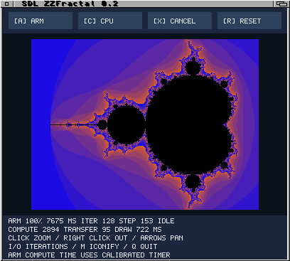

# SDL ZZFractal 0.2

An interactive SDL2 frontend to the existing owned-memory XX19c Mandelbrot
worker. The 68k runs SDL and AmigaOS; the ZZ9000 Core1 computes bounded tiles.
A developer build exposes the existing cooperative debugger and an application
hook. The standalone release embeds the worker and needs no Mac or bridge.

## Controls and screens

A/C selects ARM/CPU and renders; click the image to center and zoom 2x;
right click zooms out; arrows pan by a quarter image; I/O changes the iteration
limit between 32, 64, 128 and 256. R resets, X/Escape cancels, Q/close quits.
M iconifies to a Workbench AppIcon; double-click restores. Rendering can
continue while iconified. The Q14 precision limit and bounded view center
remain unchanged from the original fractal demo.

When idle, F5 uses Workbench, F6 opens a temporary 16-bit RTG screen and F7
requests 32-bit pixel storage. The screen's colour depth can differ from its
storage width; the application checks CyberGraphX bytes per pixel. Unsupported
modes return to Workbench. Neither Workbench preferences nor the default
public screen are changed. The app closes its own screen on exit.

SDL's new `SDL_AMIGA_PUBLIC_SCREEN` hint selects an existing named RTG public
screen for window creation. Missing/incompatible explicit screens report an
error. An unset or empty hint selects the default public screen. A public-screen
lock spans native window creation. This supplements the published window
RastPort fix; it does not implement arbitrary fullscreen scaling.

## Reusable computation transport

`amiga/compute/xx19c.h` / `.c` contain a small SDL-independent client. It accepts
only launcher-owned memory, a cache/barrier interface and a monotonic clock.
`zc_submit` commits one immutable job; `zc_poll` checks its sequence,
generation, coordinates and response version before copying pixels.
`zc_cancel` advances the generation; the outstanding response must still be
drained before another request can reuse the shared buffer. Session identity
is checked by the worker. Invalid responses/timeouts latch an error; memory
remains owned until the launcher stops Core1. Sequence/generation wrap is
rejected. A pending job times out after ten seconds; long debugger pauses
while rendering must be cancelled or resumed within that interval.

The first typed operation is a Mandelbrot tile; the second is a read-only
clock sample. This is a reusable transport boundary, not a generic arbitrary
function-call/runtime service. The 128 KiB allocation, runtime mapping probe,
cache-off ARM contract and return-before-free teardown are unchanged.

The optional `FF_TIMING` worker extension uses the existing response's unused
words (20..40) for a 64-bit compute duration, a publication timestamp, timer
control and `TIM1` version marker. Request word 36 chooses tile (0) or clock
sample (1). The original non-timing fractal protocol/build remains supported.

## Measurements

The ARM reads the Zynq global timer at `0xf8f00200` using upper/lower/upper
rollover protection; it never writes the timer or changes its configuration.
The map and read sequence follow the AMD/Xilinx standalone sources:
[xparameters_ps.h](https://github.com/Xilinx/embeddedsw/blob/master/lib/bsp/standalone/src/arm/cortexa9/xparameters_ps.h)
and [xtime_l.c](https://github.com/Xilinx/embeddedsw/blob/master/lib/bsp/standalone/src/arm/cortexa9/xtime_l.c).

Two timestamp exchanges about one second apart calibrate timer ticks against
SDL's Amiga E-clock. The record preserves the calibration span, exchange
uncertainty and timer control. A disabled/changed timer disables its estimate.
No nominal CPU frequency is assumed. ARM compute includes timing instrumentation
around each bounded kernel slice; paused/debugger/service time is excluded.
The 68k kernel is timed around its 8192-step slices. Compiler settings, cache
policy and instrumentation differ: these are application measurements, not a
fair general-purpose CPU benchmark.

- `wall_us`: whole render, including UI and cooperative scheduling.
- `cpu_us`: time inside the 68k arithmetic slices.
- `arm_us_est`: timed ARM slices converted using the calibrated timer rate.
- `transfer_us`: 68k request/result synchronization, response polling and copy.
- `colour_us`: 68k iteration-to-colour mapping into the SDL surface.
- `draw_us`: SDL surface updates, including progress display during rendering.
- `roundtrip_us`: sum of ARM request-to-response intervals, overlapping compute
  and transfer. **Do not add all these columns together.**

Completed measurements freeze while the app is idle. Iconify/restore outside
rendering does not change them. Both paths yield one OS tick per event-loop
iteration, but the amount of work per iteration differs. Therefore a shorter
ARM wall time does not establish a faster arithmetic kernel. ARM MMU/caches
remain disabled, the ARM kernel uses Clang `-O1`, 68k uses GCC `-O2`, and SDL
retains `-O0`.

## Build

From this repository, build the SDK with `scripts/build_release.py`, then run
`scripts/build_fractal.py` and `scripts/package_fractal.py`. Pass the same
`--container-command` JSON array to both builders. Clang ARM support and
LLVM ld.lld are required for the worker. The app's pin in
`examples/zzfractal/sdl.json` must match the built static library.

The standalone sources are self-contained in `examples/zzfractal/`. The flat
`xx19c.c`/`.h` files implement the reusable client described above. The source
retains conditional developer-hook support, but the public builder defines
`ZZ_RELEASE` and links no bridge code. The example includes icon-generator
source under `tools/`; supplied icons were created/read back using native
icon.library with a 131072-byte stack.

## Acceptance record

Physical acceptance on 2026-10-08 passed on the A4000TX / TF4060 / XX19c.
All 76,800 iteration counts matched the independent oracle in each of 14
completed renders: ARM/68k, default/zoom/pan, changed iterations, Workbench
and temporary 16-/32-bit screens. Six rapid cancel/zoom cycles, rendering
while iconified, restore and overlapping windows passed. The window-move
command was acknowledged; a later standalone test independently verified
the window position at (680,300). The harness now waits for asynchronous
Intuition movement before checking its position.
Idle timing stayed unchanged. Shutdown reported RET1 and released the owned
allocation; the bridge remained responsive with no registered client.

Native CGX readback sampled 475 pixels per true-colour mode: zero mismatches;
16-bit maximum channel difference 7 (tolerance 8), 32-bit difference 0.
Bridge screenshots report the P96 dummy 8-bit bitmap and lose true colour on
these screens; they are not the colour acceptance test. One bridge file-read
returned no response and succeeded on a bounded read-only retry. No commands
were blindly retried.

| Default view | Wall | Compute | Transfer | Colour mapping | SDL drawing |
| --- | ---: | ---: | ---: | ---: | ---: |
| ARM | 7.575 s | 2.894 s estimate | 94 ms | 38 ms | 745 ms |
| 68060 | 17.427 s | 2.233 s | 0 | 39 ms | 1,478 ms |

The ARM arithmetic slices are slower in this configuration despite the shorter
whole-render time. Scheduling granularity, compilers, instrumentation and
cache policy differ. Optimization and equivalent-work scheduling are next;
these measurements must not be presented as a raw processor speed ratio.
The read-only timer calibrated to 333,326,829 ticks/s over 1,014,070 us,
with a 485 us exchange uncertainty.

Local validation: 4 transport tests with sanitizers, 8 fractal/package tests,
22 debugger tests, the 138-tool MCP smoke suite, and ARM/68k builds passed.
The standalone build omits MCP/relay linkage and embeds its ARM payload.

Audio, texture-renderer compatibility, arbitrary resizing/scaling, other
hardware and cache-enabled ARM execution remain outside this milestone.

## Standalone distribution acceptance

The 1,153,524-byte standalone executable passed native LHA integrity testing
and fresh extraction. Every one of the LHA's 10 files matches the ZIP.
Extracted and installed executable MD5: `364ec823dea2615b6dc3fb5e91319177`.
Shell execution produced matching default CPU/ARM checksums `fb32f6c6`,
handled cancellation and discarded its old response. Ctrl-C shutdown returned
RET1, exited 0 and released its allocation.

The app is installed at `SD032G:Dev/SDLZZFractal-0.2/SDLZZFractal` with native
Workbench icons and a 131072-byte stack. Workbench launch through WBLoad,
the firmware-confirmation requester, default ARM rendering, an independently
verified move to (680,300), and Q quit passed. The owner port disappeared
and the bridge remained responsive after quit. No OS/firmware/preferences
or startup files changed. Close other Core1 apps before launching it.

**Remaining input check:** native iconification passed, and developer-hook
restoration passed. Synthetic mouse input on the native Workbench AppIcon
stalled the bridge, consistent with its documented Intuition icon-drag
limitation. After recovery, Workbench ARexx `ICON ROOT "SDL ZZFractal" OPEN`
returned OK without restoring the window. Physical double-click restoration
therefore remains unverified; do not describe it as a completed test. Recovery
needed no reboot, and the standalone app subsequently shut down cleanly.
The Workbench ARexx command follows the
[AmigaOS documentation](https://wiki.amigaos.net/wiki/Workbench_ARexx_Port).
